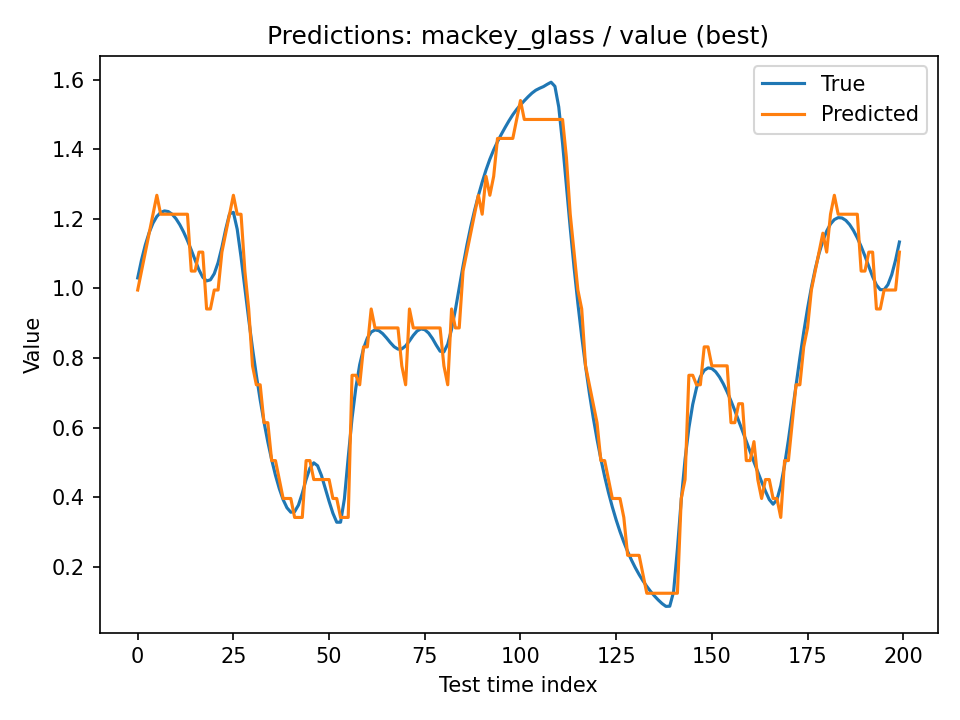
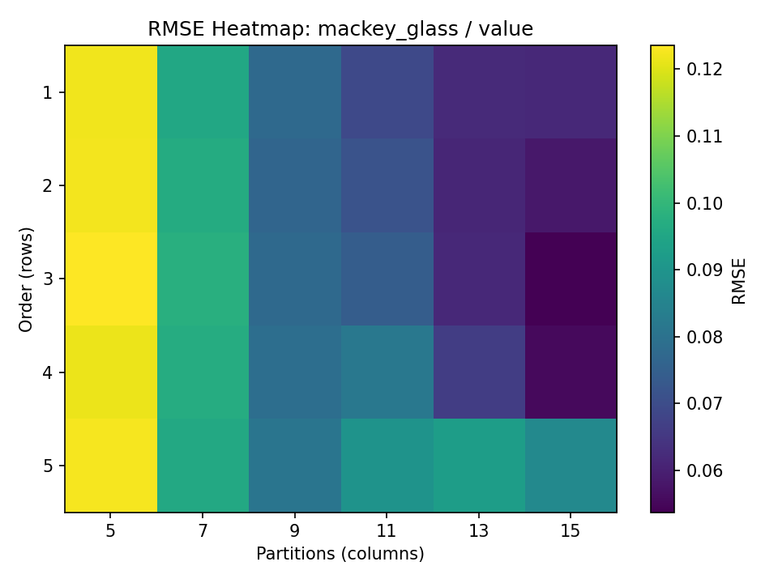
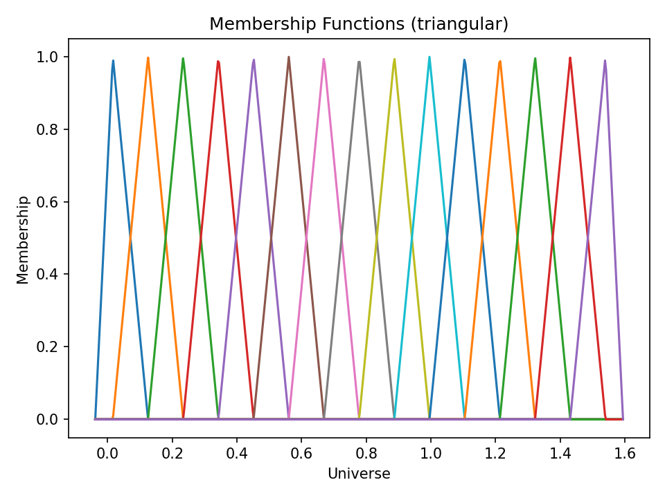
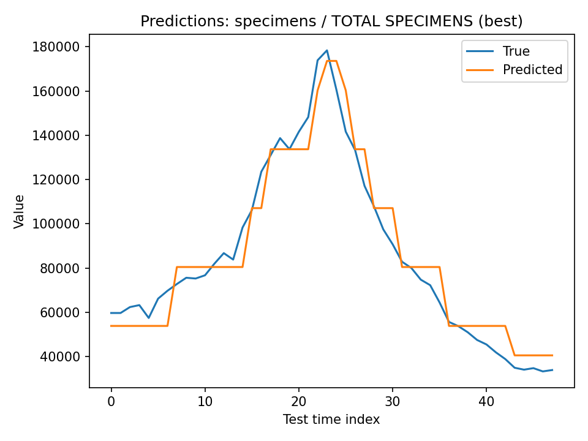
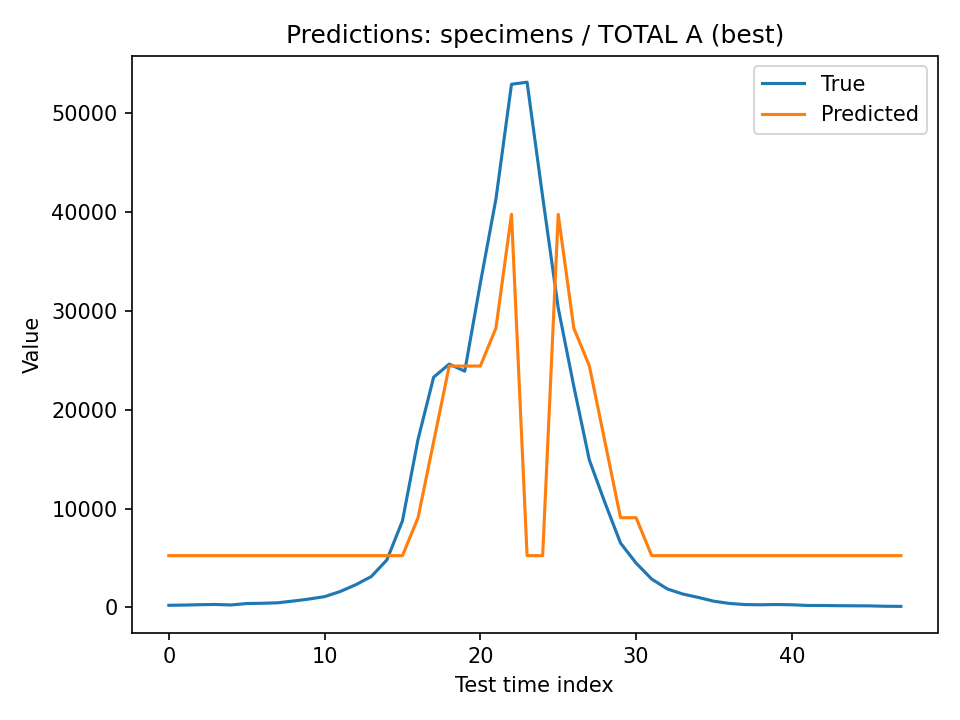
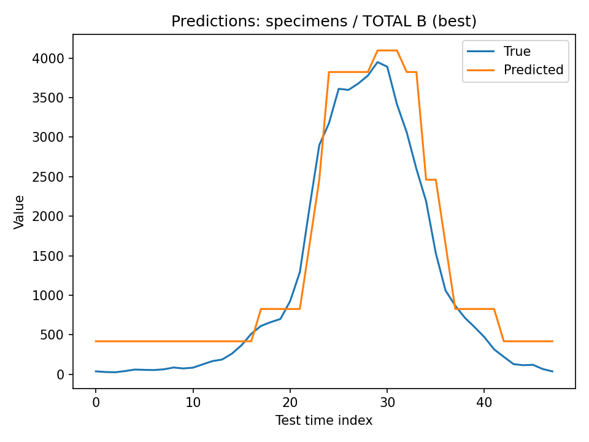
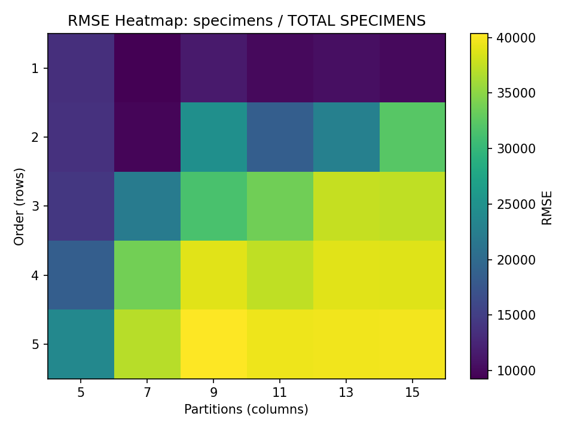
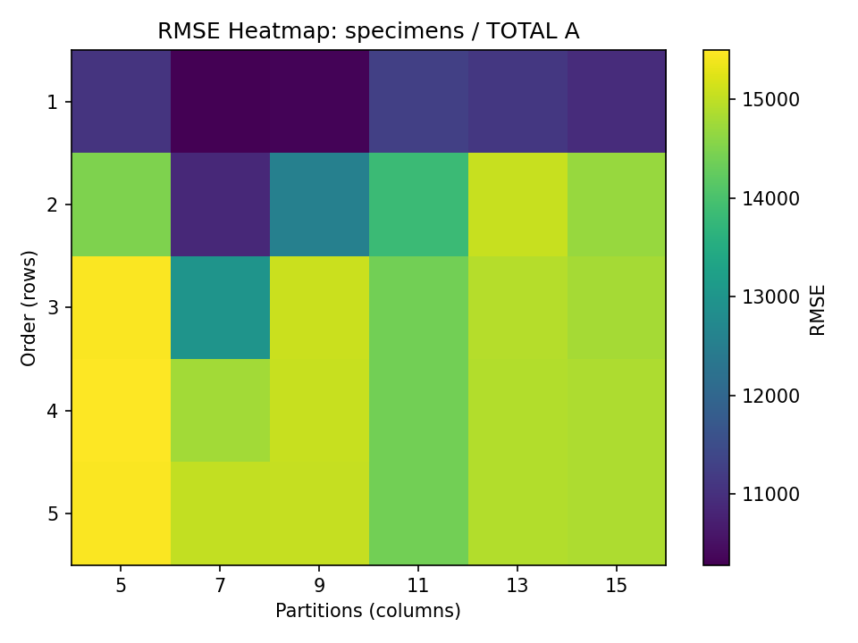
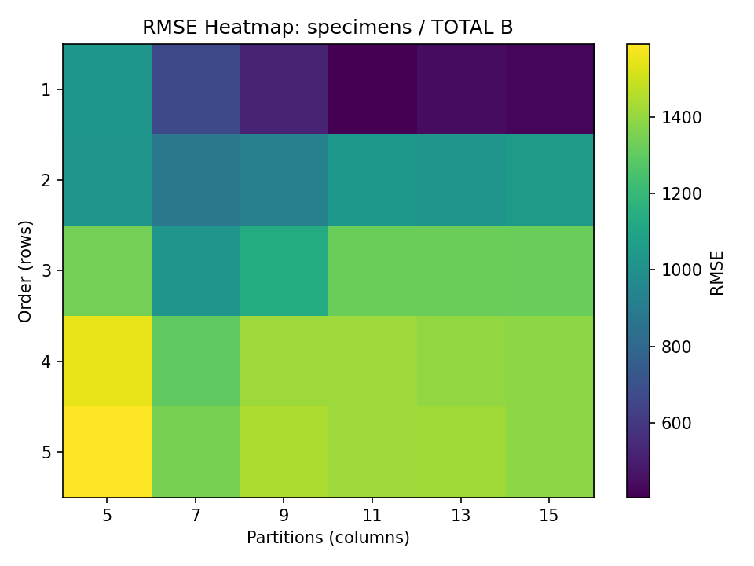

# Fuzzy Time Series Forecasting

## Overview

This project presents an implementation of Fuzzy Time Series (FTS) models for one-step-ahead forecasting.

The main objective is to study how fuzzy representations of numerical time-series data can be used for prediction. The project includes both First-Order and High-Order Fuzzy Time Series models and evaluates their performance using different model orders and numbers of fuzzy partitions.

Two datasets are used in the experiments:

- Mackey-Glass chaotic time series
- Influenza specimen count data

The implementation is built from scratch without using prebuilt fuzzy time-series libraries.

## Main Features

- First-Order Fuzzy Time Series (FOFTS)
- High-Order Fuzzy Time Series (HOFTS)
- Triangular, trapezoidal, and Gaussian membership functions
- Automatic fuzzy partition construction
- Fuzzy Logical Relationship Groups (FLRGs)
- One-step-ahead forecasting
- Grid search over model orders and partition counts
- Evaluation using RMSE, MAE, and MAPE
- Prediction plots
- RMSE heatmaps
- Membership-function visualizations
- Interactive prediction through a command-line interface

## Problem Description

The goal is to predict the next observation of a numerical time series using previous observations represented as fuzzy states.

Instead of directly learning relationships between raw numerical values, the input data is divided into fuzzy intervals. Each numerical observation is then mapped to a fuzzy set, and relationships between consecutive fuzzy states are extracted from the training data.

These relationships are used to estimate future fuzzy states and generate numerical forecasts through defuzzification.

### Inputs

The forecasting process uses:

- A univariate numerical time series
- Model order
- Number of fuzzy partitions
- Membership-function type
- Train/test split ratio

### Outputs

The system produces:

- One-step-ahead forecasts
- RMSE, MAE, and MAPE values
- Best model configuration
- Grid-search result tables
- Prediction plots
- RMSE heatmaps
- Membership-function plots

## Datasets

### Mackey-Glass Dataset

The Mackey-Glass dataset is a chaotic numerical time series commonly used for evaluating forecasting methods.

| Item | Description |
| --- | --- |
| File | `mackey_glass.csv` |
| Type | Chaotic numerical time series |
| Number of rows | 1,000 |
| Number of columns | 2 |
| Columns | `index`, `value` |
| Forecast target | `value` |
| Missing values | None |
| Format | CSV |

The `value` column is extracted and converted to floating-point values before training.

No additional normalization or missing-value processing is required for the current dataset.

### Influenza Specimens Dataset

The second dataset contains weekly influenza specimen information.

| Item | Description |
| --- | --- |
| File | `Specimens-Train.xlsx` |
| Type | Weekly influenza specimen data |
| Excel sheet | `Speciment` |
| Number of rows | 238 |
| Number of columns | 8 |
| Format | Excel |
| Missing values | None |

The available columns are:

- `YEAR`
- `WEEK`
- `TOTAL SPECIMENS`
- `TOTAL A`
- `TOTAL B`
- `PERCENT POSITIVE`
- `PERCENT A`
- `PERCENT B`

The following three series are used as forecasting targets:

- `TOTAL SPECIMENS`
- `TOTAL A`
- `TOTAL B`

Each target is treated as an independent univariate time series.

## Forecasting Pipeline

The complete forecasting procedure consists of the following steps:

1. Load the selected dataset.
2. Extract the target time series.
3. Divide the observations chronologically into training and testing sets.
4. Determine the universe of discourse from the training data.
5. Expand the universe using a small padding value.
6. Divide the universe into equal-width fuzzy intervals.
7. Construct the membership functions.
8. Convert numerical observations into fuzzy states.
9. Generate Fuzzy Logical Relationships.
10. Group the relationships into FLRGs.
11. Perform one-step-ahead forecasting on the test data.
12. Convert predicted fuzzy states back to numerical values.
13. Calculate forecasting errors.
14. Repeat the experiment for different parameter combinations.
15. Select the configuration with the lowest RMSE.

## Fuzzy Partitioning

The universe of discourse is constructed from the minimum and maximum values of the training series.

A padding of 5% is added to the range before constructing the fuzzy partitions.

The implementation supports three membership-function types:

- Triangular
- Trapezoidal
- Gaussian

The default experiments use triangular membership functions.

During fuzzification, each numerical observation is assigned to the fuzzy set with the highest membership value.

## First-Order Fuzzy Time Series

In the First-Order FTS model, the next fuzzy state is estimated using only the immediately preceding fuzzy state.

The relationship can be represented as:

`F(t-1) -> F(t)`

The relationships observed in the training data are grouped into Fuzzy Logical Relationship Groups.

These groups are then used to forecast the next fuzzy state.

## High-Order Fuzzy Time Series

The High-Order FTS model uses multiple previous fuzzy states instead of only one.

For a model of order `k`, the relationship can be represented as:

`(F(t-k), ..., F(t-1)) -> F(t)`

This allows the forecasting model to incorporate a longer history of the time series.

## Defuzzification

After a fuzzy state is predicted, it must be converted back into a numerical value.

The implementation uses the midpoint values of the consequent fuzzy intervals.

When multiple consequent fuzzy sets are available, their midpoint values are averaged to produce the final prediction.

For antecedent patterns that were not observed during training, the global mean of the training series is used as the fallback prediction.

## Experimental Setup

The experiments evaluate several combinations of model order and fuzzy partition count.

| Parameter | Value |
| --- | --- |
| Train/Test Split | 80% / 20% |
| Model Orders | 1, 2, 3, 4, 5 |
| Number of Partitions | 5, 7, 9, 11, 13, 15 |
| Default Membership Function | Triangular |
| Universe Padding | 0.05 |
| Model Selection Metric | RMSE |
| Fallback Strategy | Training global mean |

A grid search is performed over all combinations of model order and partition count.

The configuration with the lowest RMSE is selected as the best model for each target series.

## Evaluation Metrics

Three metrics are used to evaluate forecasting performance.

### RMSE

Root Mean Squared Error gives greater weight to larger forecasting errors and is used as the main criterion for selecting the best model.

### MAE

Mean Absolute Error represents the average absolute difference between the actual and predicted values.

### MAPE

Mean Absolute Percentage Error measures the forecasting error as a percentage of the actual observations.

MAPE should be interpreted carefully when actual values are close to zero because the percentage error can become very large.

## Results

The best configurations obtained from the saved grid-search results are shown below.

| Series | Best Order | Best Partitions | RMSE | MAE | MAPE |
| --- | ---: | ---: | ---: | ---: | ---: |
| Mackey-Glass / `value` | 3 | 15 | 0.0538 | 0.0433 | 6.9028 |
| Influenza / `TOTAL SPECIMENS` | 1 | 7 | 9281.4843 | 7586.1808 | 10.7146 |
| Influenza / `TOTAL A` | 1 | 7 | 10285.1324 | 6584.2667 | 1056.4019 |
| Influenza / `TOTAL B` | 1 | 11 | 405.0040 | 337.5056 | 254.6614 |

The Mackey-Glass series achieved its lowest saved RMSE using a third-order model with 15 fuzzy partitions.

For the influenza data, the best saved configurations use first-order models, while the preferred number of partitions varies between the target series.

The large MAPE values for some influenza targets are related to observations with small actual values, where percentage-based errors can become very large.

## Visual Results

### Mackey-Glass Predictions



This plot compares the actual Mackey-Glass test observations with the forecasts generated by the selected FTS model.

### Mackey-Glass RMSE Heatmap



The heatmap compares RMSE values across different model orders and fuzzy partition counts.

### Mackey-Glass Membership Functions



This figure shows the fuzzy membership functions associated with the selected Mackey-Glass configuration.

### Influenza - Total Specimens



The figure compares actual and predicted values for `TOTAL SPECIMENS`.

### Influenza - Total A



The figure compares actual and predicted values for `TOTAL A`.

### Influenza - Total B



The figure compares actual and predicted values for `TOTAL B`.

### Influenza RMSE Heatmaps







These heatmaps show how forecasting performance changes with different combinations of model order and partition count.

## Project Structure

```text
fuzzy-time-series-forecasting/
|
├── README.md
├── requirements.txt
├── main.py
├── config.py
├── data.py
├── fuzzy_sets.py
├── fts_model.py
├── experiments.py
├── metrics.py
├── visualize.py
├── cli.py
├── mackey_glass.csv
├── Specimens-Train.xlsx
└── outputs/
    ├── mackey_glass__value__grid_results.csv
    ├── mackey_glass__value__membership.png
    ├── mackey_glass__value__predictions.png
    ├── mackey_glass__value__rmse_heatmap.png
    ├── specimens__TOTAL_SPECIMENS__grid_results.csv
    ├── specimens__TOTAL_SPECIMENS__membership.png
    ├── specimens__TOTAL_SPECIMENS__predictions.png
    ├── specimens__TOTAL_SPECIMENS__rmse_heatmap.png
    ├── specimens__TOTAL_A__grid_results.csv
    ├── specimens__TOTAL_A__membership.png
    ├── specimens__TOTAL_A__predictions.png
    ├── specimens__TOTAL_A__rmse_heatmap.png
    ├── specimens__TOTAL_B__grid_results.csv
    ├── specimens__TOTAL_B__membership.png
    ├── specimens__TOTAL_B__predictions.png
    └── specimens__TOTAL_B__rmse_heatmap.png
```

## File Description

| File | Description |
| --- | --- |
| `main.py` | Runs the complete forecasting and evaluation pipeline |
| `config.py` | Contains dataset and experiment configuration |
| `data.py` | Loads datasets and extracts the required time series |
| `fuzzy_sets.py` | Implements fuzzy partitions, membership functions, and fuzzification |
| `fts_model.py` | Implements FTS training, FLRG construction, defuzzification, and forecasting |
| `experiments.py` | Performs experiments over different model orders and partition counts |
| `metrics.py` | Calculates RMSE, MAE, and MAPE |
| `visualize.py` | Generates prediction plots, membership plots, and RMSE heatmaps |
| `cli.py` | Provides an interactive interface for forecasting with the selected model |
| `requirements.txt` | Lists the required Python packages |
| `outputs/` | Contains generated results and visualizations |

## Installation

Create a Python virtual environment:

```bash
python3 -m venv .venv
```

Activate it on macOS or Linux:

```bash
source .venv/bin/activate
```

On Windows:

```bash
.venv\Scripts\activate
```

Install the required packages:

```bash
pip install -r requirements.txt
```

## Requirements

The project uses the following Python packages:

- NumPy
- Pandas
- OpenPyXL
- Matplotlib

## Usage

Run the complete experiment pipeline with:

```bash
python main.py
```

The program processes each configured dataset and target series, evaluates the different FTS configurations, selects the best model, and saves the generated results in the `outputs/` directory.

After processing each target series, the program asks:

```text
Do you want to run the interactive predictor for this best model? (y/n)
```

Enter `y` to use the interactive predictor or `n` to continue without it.

An example of interactive input is:

```text
history> [120, 125, 128]
```

The number of historical observations must be at least equal to the order of the selected model.

## Generated Outputs

For every forecasting target, the program generates:

- `*_grid_results.csv` - evaluation results for the tested configurations
- `*_predictions.png` - actual versus predicted values
- `*_rmse_heatmap.png` - RMSE across order and partition combinations
- `*_membership.png` - membership functions for the selected configuration

All generated files are stored in the `outputs/` directory.

## Technologies and Concepts

- Python
- NumPy
- Pandas
- Matplotlib
- OpenPyXL
- Fuzzy Logic
- Fuzzy Sets
- Fuzzy Time Series
- First-Order FTS
- High-Order FTS
- Membership Functions
- Fuzzy Logical Relationship Groups
- Time Series Forecasting
- Grid Search
- Data Visualization

## Possible Improvements

Some possible extensions of this project include:

- Adding more membership-function configurations to the experiments
- Supporting additional time-series datasets
- Adding command-line parameters for experiment configuration
- Saving selected model configurations for later use
- Comparing additional defuzzification strategies
- Adding automated tests
- Improving the interactive forecasting interface

## Course Information

**Course:** Fuzzy Sets and Systems  
**University:** Shiraz University

## Author

Saghar Kheradmand
